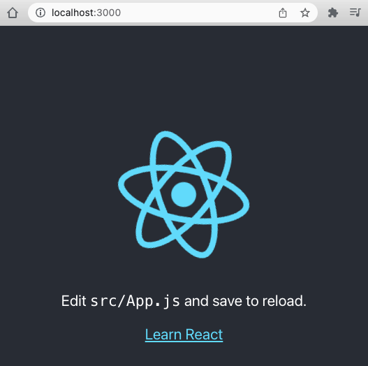

# renovatebot

+ [12 Tips to Self-host Renovate Bot](https://jerrynsh.com/12-tips-to-self-host-renovate-bot/)
+ [renovatebot/renovate](https://github.com/renovatebot/renovate)
+ [How to Update Dependencies Safely and Automatically with GitHub Actions and Renovate](https://www.freecodecamp.org/news/update-dependencies-automatically-with-github-actions-and-renovate)

```bash
$ npx create-react-app my-app
$ cd my-app
$ npm start

> my-app@0.1.0 start
> react-scripts start

(node:74622) [DEP_WEBPACK_DEV_SERVER_ON_AFTER_SETUP_MIDDLEWARE] DeprecationWarning: 'onAfterSetupMiddleware' option is deprecated. Please use the 'setupMiddlewares' option.
(Use `node --trace-deprecation ...` to show where the warning was created)
(node:74622) [DEP_WEBPACK_DEV_SERVER_ON_BEFORE_SETUP_MIDDLEWARE] DeprecationWarning: 'onBeforeSetupMiddleware' option is deprecated. Please use the 'setupMiddlewares' option.
Starting the development server...
Compiled successfully!

You can now view my-app in the browser.

  Local:            http://localhost:3000
  On Your Network:  http://192.168.1.11:3000

Note that the development build is not optimized.
To create a production build, use npm run build.

webpack compiled successfully
```


